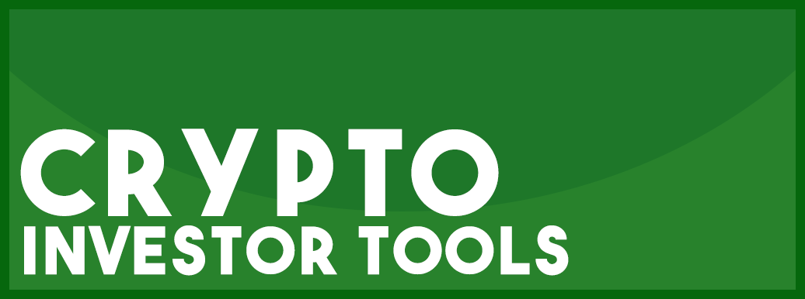

# Cryptocurrency Investor Tools

## News Aggregators

* Cryptopanic
https://cryptopanic.com/

* CoinBuzz.stream
https://cryptocontrol.io/en/social

* Coinspectator
https://coinspectator.com/

* CryptoFlash
https://cryptoflash.io/

* Faws
https://faws.com/

* Coinlib
https://coinlib.io/

* CryptoCoin
http://cryptocoin.cc/

* CoinLive
https://www.coinlive.io/pro

* CryptoControl
https://cryptocontrol.io/

* CoinNA
https://www.coinna.com/

* CryptoCoinOwl
https://ccowl.com/

* News Now
http://www.newsnow.co.uk/h/Business+&+Finance/Cryptocurrencies

* CoinBeagle
https://www.coinbeagle.com/news/

* CoinLoop
https://coinloop.io/

### --- Reddit For Aggregated News and Off-topic

* /r/Bitcoin
https://www.reddit.com/r/Bitcoin

* /r/Ethereum
https://www.reddit.com/r/Ethereum

* /r/ethtrader
https://www.reddit.com/r/ethtrader/

* /r/Ripple
https://www.reddit.com/r/Ripple

* /r/btc
https://www.reddit.com/r/btc/

* /r/CryptoCurrency/
https://www.reddit.com/r/CryptoCurrency/

### --- 4Chan For Aggregated News and Off-topic

* /biz
http://boards.4chan.org/biz/

* /biz - Archieve
http://boards.4chan.org/biz/archive

## News Sites

* Coindesk
https://www.coindesk.com/

* CoinTelegraph
https://cointelegraph.com/

* Bitcoin.com
http://news.bitcoin.com/

* Cryptovest
https://cryptovest.com/

* CCN
http://ccn.com/

* Hacked
https://hacked.com/

* Bitcoinist
http://bitcoinist.com/

* Blockonomi
http://blockonomi.com/

* Cryptoslate
http://cryptoslate.com/

* NewsBTC
http://newsbtc.com/

* Invest In Blockchain
https://investinblockchain.com/

* Bitcoin Magazine
https://bitcoinmagazine.com/

* CoinSpeaker
http://www.coinspeaker.com/

* Cryptovest
https://cryptovest.com/

* Blokt
https://blokt.com

* Nulltx
https://nulltx.com/

* CNBC
https://www.cnbc.com/cryptocurrency/

* Forbes
https://www.forbes.com/crypto-blockchain

## Valuation and Ranking Sites

* Coingecko
https://www.coingecko.com

* CryptoCompare 
https://www.cryptocompare.com/

* Coinranking
https://coinranking.com/

* Coinmarketcap
https://coinmarketcap.com

* CoinCap
https://coincap.io/

* LiveCoinWatch
https://www.livecoinwatch.com/

* CoinLib
https://coinlib.io/

* Coincall
https://coincall.io/

* World Coin Index
https://www.worldcoinindex.com/

* Coirrency
https://www.coirrency.com/features/dashboard

