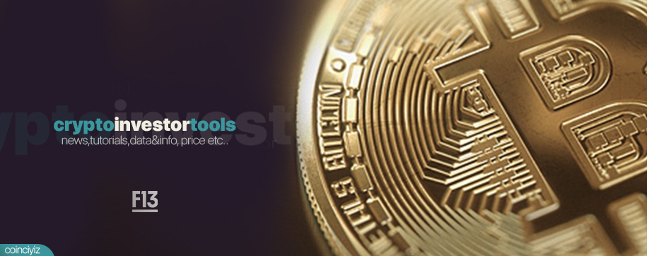

# [Cryptocurrency Investor Tools](https://github.com/f13end/Crypto-Investor-Tools) 

  

**A collection of awesome lists for cryptocurrency traders, investors and researchers.**

Your [contributions](Contributing.md) are always welcome !

# Cryptocurrency Investor Tools
## News Aggregators

* **Cryptopanic** News aggregator platform indicating impact on price and market for traders and cryptocurrency enthusiasts.
https://cryptopanic.com/

* **CoinBuzz.stream** News aggregator that tracks cryptocurrencies, ICOs, Blockchain related news. View articles from over 100+ different sources and stay up to date.
https://cryptocontrol.io/en/social

* **Coinspectator** Monitor the latest cryptocurrency news with our real-time aggregator bringing you the top crypto news today in one simple feed 24/7.
https://coinspectator.com/

* **CryptoFlash** ~~CryptoFlash is a news aggregator platform tracking the latest news & rumors about more than 200 cryptocurrencies. Join us and keep up to date with what's going on in the cryptocurrency ecosystem!
https://cryptoflash.io/~~

* **Faws** Personalized cryptocurrencies news aggregator for investor looking to follow impact of news on market, be notified in realtime on any news, analysis or press releases matching with your watchlist.
https://faws.com/

* **Coinlib** Live and historic cryptocurrency prices, news, charts and coin rankings. Portfolio tracking, price alerts and other advanced tools.
https://coinlib.io/

* **CryptoCoin** ~~Digital Cryptocurrency Software Database and News Portal.
http://cryptocoin.cc/~~

* **CoinLive** ~~Find the latest cryptocurrency news collected from around the net. Simple in Website 
https://www.coinlive.io/pro~~

* **CryptoControl** News aggregator that tracks cryptocurrencies, ICOs, Blockchain related news. View articles from over 100+ different sources and stay up to date.
https://cryptocontrol.io/

* **CoinNA** Cryptocurrency news aggregator for Bitcoin, Ethereum, altcoins, cryptocurrencies, exchanges and all other things blockchain related.
https://www.coinna.com/

* **CryptoCoinOwl** Latest cryptocurrency news. Live prices and crypto charts. Useful tools that help traders and investors make educated decisions. Dashboard for bitcoin, ethereum, ripple and other crypto coins.
https://ccowl.com/

* **News Now** Get news as it breaks from 1000s of local, national and international sources - a one stop shop for news, sport, entertainment and business news - by NewsNow.
http://www.newsnow.co.uk/h/Business+&+Finance/Cryptocurrencies

* **CoinBeagle** CoinBeagle provides the Latest Cryptocurrency News. Covering recent Coin, Token and Blockchain News. 11 Feeds with Auto Ad and Sponsored Post Removal.
https://www.coinbeagle.com/news/

* **CoinLoop** The number one cryptocurrency dashboard. Featuring advanced trading indicators, view prices, live charts and track your cryptocurrency portfolio and the coins you care about.
https://coinloop.io/

* **Coins.live** Cryptocurrency prices, Prortfolio Tracker, Crypto News - Search, sort and filter all Cryptocurrency prices in real time.
https://coins.live/news/

* **Bitmakler** BitMakler will keep You informed on the latest events in the cryptocurrency world, Blockchain, ICO, Financial Technology(Fintech), solve issues mining and trading cryptocurrencies.
https://bitmakler.net/

* **Coinhooked** ~~Top News from the best cryptocurrency news sources, daily news recap, infographics and Cryptocurrency News Today.
https://coinhooked.com/~~

* **Bitcoinagile** Real-Time Market Data and News Discovery Platform.
http://bitcoinagile.com/default

* **Alltop**
https://alltop.com/cryptocurrency

* **Today on Chain**
https://www.todayonchain.com/

* **Coins.live**
https://coins.live/news/

* **Cryptonews AU**
https://cryptonews.com.au/

* **Coinspectator**
https://coinspectator.com/

* **Investing Crypto News**
https://www.investing.com/news/cryptocurrency-news

* **Crypto Control**
https://cryptocontrol.io/en/

* **Coinbeagle**
https://www.coinbeagle.com/news/

* **Geek Wrapped**
https://www.geekwrapped.com/

### --- Reddit For Aggregated News and Off-topic

* /r/Bitcoin
https://www.reddit.com/r/Bitcoin

* /r/Ethereum
https://www.reddit.com/r/Ethereum

* /r/ethtrader
https://www.reddit.com/r/ethtrader/

* /r/Ripple
https://www.reddit.com/r/Ripple

* /r/btc
https://www.reddit.com/r/btc/

* /r/CryptoCurrency/
https://www.reddit.com/r/CryptoCurrency/

* /r/CryptoMarkets/
https://www.reddit.com/r/CryptoMarkets/

* /r/CryptoCurrencies/
https://www.reddit.com/r/CryptoCurrencies/

* /r/Crypto_Currency_News/
https://www.reddit.com/r/Crypto_Currency_News/
 
* /r/ICOAnalysis/ 
https://www.reddit.com/r/ICOAnalysis/

* /r/BitcoinBeginners/
https://www.reddit.com/r/BitcoinBeginners/

### --- 4Chan For Aggregated News and Off-topic

* /biz
http://boards.4chan.org/biz/

* /biz - Archieve
http://boards.4chan.org/biz/archive

## News Sites

* **Coindesk** CoinDesk provides news and analysis on the trends, changes, technologies, companies, and people in the Bitcoin and digital currency world.
https://www.coindesk.com/

* **CoinTelegraph** Bitcoin & Ethereum news, analysis and review about technology, finance, blockchain and markets - cryptocurrency news.
https://cointelegraph.com/

* **Bitcoin.com** Get started with Bitcoin: find a wallet, buy bitcoin, shop with bitcoin, read bitcoin news, and get involved on the forum.
http://news.bitcoin.com/

* **BraveNewCoin** Brave New Coin (BNC) is a Blockchain and Crypto Asset Market Data company. We publish technical analysis and research, used by key decision makers.
https://bravenewcoin.com/home

* **Bitcoin Exchange Guide**
https://bitcoinexchangeguide.com/

* **Cryptovest** Cryptovest - World's largest cryptocurrency and ICO media publisher offers the latest news, reviews and knowledge centre.
https://cryptovest.com/

* **CCN** At CCN we provide you with the latest cryptocurrency news, including cryptocurrencies like Ethereum, Bitcoin, EOS, NEO, Litecoin, and major ICOs.
https://www.ccn.com/crypto/

* **Hacked** Exclusive analysis of cryptocurrencies like Bitcoin, Ethereum, Litecoin, including rating of Initial Coin Offerings (ICO), trade recommendations, Stocks, Forex, Tutorials, and market recaps.
https://hacked.com/

* **Bitcoinist** Bitcoinist is a Bitcoin news portal providing breaking news about decentralized digital money, blockchain technology and Fintech.
http://bitcoinist.com/

* **Cryptopotato** Find resources for anything related to the Cryptocurrencies world - Bitcoins and Altcoins. Crypto Trading 'How To', Index and Initial Coin Offerings (ICOs)
https://cryptopotato.com/

* **Blockonomi** Cryptocurrency News & Your Guide to the Blockchain Economy.
http://blockonomi.com/

* **Cryptoslate** CryptoSlate is a popular destination for blockchain researchers — featuring cryptocurrency news, coin rankings, a product database and blockchain events.
http://cryptoslate.com/

* **NewsBTC** NewsBTC is a news service that covers bitcoin news, technical analysis & forecasts for bitcoin and other altcoins.
http://newsbtc.com/

* **Invest In Blockchain** Invest In Blockchain is your source for the latest crypto news, investment opinion, and informative, engaging content on blockchain education!
https://investinblockchain.com/

* **Bitcoin Magazine** Founded in 2011, Bitcoin Magazine is the oldest and most trusted source of news, insight, reviews, guides, and price analysis on bitcoin, ethereum, blockchain technology, cryptocurrencies, the darkweb, and other decentralized technologies.
https://bitcoinmagazine.com/

* **CoinSpeaker** The latest news about Bitcoin and altcoins, Blockchain Technology, ICO, FinTech, Internet of Things.
http://www.coinspeaker.com/

* **Cryptovest** World's largest cryptocurrency and ICO media publisher offers the latest news, reviews and knowledge centre.
https://cryptovest.com/

* **Blokt** Blokt is a leading blockchain, Bitcoin, Ethereum and cryptocurrency resource. We provide the latest in breaking crypto news, cryptocurrency guides, ICO analysis, price analysis, security tips and industry tools.
https://blokt.com

* Nulltx
https://nulltx.com/

* **CNBC** Get latest business news on stock markets, financial & earnings on CNBC. View world markets streaming charts & video; check stock tickers and quotes.
https://www.cnbc.com/cryptocurrency/

* **Forbes** Forbes is a global media company, focusing on business, investing, technology, entrepreneurship, leadership, and lifestyle.
https://www.forbes.com/crypto-blockchain

* **Cryptonews** Cryptocurrency News feed is a one stop shop destination on all the latest news in crypto. Cryptocurrency News today play an important role in the awareness and expansion of of the crypto industry, so don’t miss out on all the buzz and stay in the known on all the Latest Cryptocurrency News.
https://cryptonews.com/

* **Coinidol** Bitcoin, Blockchain, Cryptocurrency and Techlonogy News.
https://coinidol.com/

* **Crypto News Review** Independent news and views for the blockchain community of enthusiasts and investors. Cryptocurrencies, blockchain tech, ICOs, regulation and markets analysis.
https://cryptonewsreview.com

* **Eth News** ETHNews.com is the authority in news, prices, analysis and information on Ethereum and its decentralized blockchain platform and cryptocurrency.
https://www.ethnews.com/

* **AMB Crypto**
https://eng.ambcrypto.com/

* **BTC Manager**
https://btcmanager.com/

* **The Merkle**
https://themerkle.com/

* **Altcoinbuzz**
https://www.altcoinbuzz.io/

* **Crypto Newsz**
https://www.cryptonewsz.com/

* **Coin Monks**
https://medium.com/coinmonks

* **Crypto Gon**
https://www.cryptogon.com/

* **Box Mining** The most recent insights about Bitcoin, Ethereum and the Crypto industry at Boxminin - Cryptocurrency trends, Wallets and Reviews.
https://boxmining.com/

* **Coin Funda**
https://coinfunda.com/

* **Decrypt** Read the latest Bitcoin and Ethereum news from Decrypt. Get the latest on cryptocurrency prices, breaking news, and more about Bitcoin and blockchain.
https://decrypt.co/

* **The Block Crypto** The Block is your reliable and newsworthy source for all things pertaining to blockchain and crypto.
https://www.theblockcrypto.com/

* **BTC Wires** BTC Wires is an online digital media platform which provides information for the crypto and blockchain technology.
https://www.btcwires.com/

* **BeIN Crypto**
https://beincrypto.com/

* **Global rypto Press**
https://www.globalcryptopress.com/

## Valuation and Ranking Sites

* **Coingecko** CoinGecko is a coin market ranking chart app that ranks digital currencies by developer activity, community, and liquidity. Check out the latest ranking for major cryptocurrencies such as Bitcoin, Litecoin, Peercoin, and more.
https://www.coingecko.com

* **CryptoCompare** Bring you all the latest streaming pricing data in the world of cryptocurrencies. Whether you are just interested in the bitcoin price or you want to see the latest ether volume, we have all the data available at your fingertips. Join the discussion on our active forums, get daily market updates, and gain access to the best reviews and data in the cryptocurrency sector.
https://www.cryptocompare.com/

* **Coinranking** Cryptocurrency price tracker. Mobile-friendly and fast. Thousands of coins, like Bitcoin, Ethereum and many more.
https://coinranking.com/

* **Coinmarketcap** Cryptocurrency market cap rankings, charts, and more.
https://coinmarketcap.com

* **CoinCap** Real-time cryptocurrency market cap rankings, trading charts, and more.
https://coincap.io/

* **LiveCoinWatch** The best real-time crypto price index with graphs & historical data for 1500+ coins including bitcoin, ethereum, & altcoins from major cryptocurrency exchanges.
https://www.livecoinwatch.com/

* **CoinLib** Live and historic cryptocurrency prices, news, charts and coin rankings. Portfolio tracking, price alerts and other advanced tools.
https://coinlib.io/

* **Coincall** ~~Track and manage your crypto portfolio - Mobile friendly & fast. Follow Bitcoin, Ethereum and 1000 other major cryptocurrencies
https://coincall.io/~~

* **World Coin Index** Cryptocoins ranked by 24hr trading volume, price info, charts, market cap and news.
https://www.worldcoinindex.com/

* **Coirrency** ~~Cryptocurrency market cap rankings, charts, and more.
https://www.coirrency.com/features/dashboard~~

* **99Bitcoins** 99Bitcoins supplies video and text tutorial on how to buy Bitcoins with Paypal, Credit Card, debit card and more. We also supply you with your first Bitcoin.
https://99bitcoins.com/

* **Altcoins.racing** ~~Alcoins Racing monitors the change in cryptocurrency exchange rates within a day, a week or a month. The service covers hundreds of popular and not so popular altcoins. See the top winners and losers.
https://altcoins.racing/~~

* **MyToken** China's most popular cryptocurrency platform.
https://www.mytoken.io/

* **Narmb** ~~Cryptocurrency market cap rankings, charts, and more.
https://www.narmb.com/?locale=en~~

* **ChainShuttle** chainshuttle is a daily report on trending cryptocurrency, based on social media activity, price, volume and a bit of magic.
https://chainshuttle.com/

* **Onchainfx** 
https://onchainfx.com/

* **Coincodex** Complete cryptocurrency market coverage with real-time coin prices, charts and crypto market cap featuring over 7247 coins on more than 291 exchanges.
https://coincodex.com/

* **Coincheckup** Coincheckup is a cryptocurrency analysis and research platform designed to offer you transparent information on each cryptocurrency and help your investment
https://coincheckup.com/

* **Bit Info Charts**
https://bitinfocharts.com/index_v.html

* **Coinpaprika** Coinpaprika is a Cryptocurrency Market Research Platform. We deliver data from over 25 000 Cryptocurrency Markets. Check the latest Cryptocurrency Prices
https://coinpaprika.com/

* **Coin360** Watch the heatmap of cryptocurrency prices, market capitalizations, and volumes on COIN360. Add our widget to track the price of BTC, ETH, XRP, LTC, BCH, ...
https://coin360.com/

* **Lunarcrush** Get real-time cryptocurrency prices and social data for Bitcoin, Ethereum, and 2000 other altcoin and blockchain projects.
https://lunarcrush.com/

* **Santiment** Analyze crypto markets and find data-driven opportunities to optimize your investing. Santiment is a behavior analytics platform
https://app.santiment.net/

* **Glassnode** On-Chain Data and Intelligence Platform
https://glassnode.com/

* **Blockchair** Block explorer and the most powerful API for BTC, ETH, XRP, XLM, BCH, LTC, DASH, BSV, DOGE, GRS and TON that allow you to find, sort and filter
https://blockchair.com/

* **Bad Bitcoin** The Badbitcoin Project Exposing bitcoin and cryptocurrency frauds since Feb 2014
https://www.badbitcoin.org/

* **Dapp Radar** DappRadar provides information and insights about all the existing dapps! At the tap of your finger, find the most successful and used decentralized games
https://dappradar.com/

* **Dapp** Dapp.com is a space where everyone can discover what decentralized technology is and how it can transform the world. Find Best Decentralized Applications
https://www.dapp.com/

* **Appco** Blockstack Apps
https://app.co/

## Cryptocurrency Data & Info Sites

* **Bitcoinity**
http://data.bitcoinity.org

* **Crypto Data Download**
https://www.cryptodatadownload.com/

* **Data Worlds**
https://data.world/datasets/cryptocurrency

* **Knoema**
https://knoema.com/insights/Cryptocurrency

* **Kaggle Datasets**
https://www.kaggle.com/datasets?search=crypto

* **Cryptocurrency Data in Google Sheets**
https://spreadstreet.io/

* **Bitcoin vs The World's Money Supplies**
https://bitcoinmoneysupply.xyz/

* **Markets & Blockchain Data**
http://data.bitcoinity.org/markets/volume/30d?c=e&t=b

* **View charts about the OP_RETURN script in the Bitcoin blockchain**
https://opreturn.org/

* **Alternative.me** - provide important information about the crypto market at a single glance.
https://alternative.me/crypto/

* **Volatility Index**
https://www.buybitcoinworldwide.com/volatility-index/

## Coin Events & Calendar Sites

* **Coinmarketcal** The economic calendar for the cryptocurrency market. Evidence-based and community-driven.
https://coinmarketcal.com/

* **Coins Calendar** CoinsCalendar is a cryptocurrency events calendar. You will be first to know about all upcoming hard fork, exchange listings, releases, updates, conferences etc.
https://www.coinscalendar.com/

* **cryptocalendar.pro** ~~Cryptocurrency calendar: coins and tokens events, hard forks, exchange listings etc, ICOs. Don't miss important events!
https://cryptocalendar.pro/~~

* **Coinschedule** ~~The original list of ICOs (Initial Coin Offering) and Token Sales, Crypto Conferences and News for Bitcoin, Ethereum, Waves, Ripple and other altcoins.
https://www.coinschedule.com/~~

* **Coindar** Cryptocurrency calendar will notify you about releases, hard forks, tokens swaps, meetups, conferences, listings on the exchanges, etc.
https://coindar.org/

* **Coincalendar.info** ~~Hot Events Hot Upcoming Cryptocurrency Events
http://www.coincalendar.info/~~

* **Coinmarketcap Events** While Coinmarketcap's events page is rudimentary, it's perfect for keeping track of upcoming blockchain conferences of note. 
https://coinmarketcap.com/events/

* **Coincalendar.cc** ~~A crypto calendar with events, roadmap ICO calendar of all your favourite cryptocurrencies. The most complete coin calendar.
https://www.coincalendar.cc/~~

* **Cryptoslate Events** CryptoSlate publishes the largest cryptocurrency and blockchain event directory on the internet.
https://cryptoslate.com/events/

* **Coindar** Cryptocurrency calendar
https://coindar.org/

## Live Price & Data Watcher Sites

* **Cryptowatch** Live price charts and market data for Bitcoin, Ethereum, and more.
https://cryptowat.ch/

* **Bitcoin Wisdom** Live Bitcoin/Litecoin charts with EMA, MACD and other indicators.
https://bitcoinwisdom.io/

* **BTC.Amfeed** ~~Watch live large Bitcoin market buys & sells from all major exchanges in real-time.
http://btc.amfeed.com/~~

* **ArbingTool** Monitor arbitrage opportunities between exchanges. Also live coin prices and fee schedule avaliable.
https://www.arbing.info/

* **Significant Trades**
https://aggr.trade/

* **The Fastest Bitcoin Block Reader**
https://sochain.com/

* **Realtime Bitcoin Transaction**
https://bitcointicker.co/

* **Statoshinfo - Realtime Bitcoin Node Stats**
https://statoshi.info/

* **Cryptrader**
https://cryptrader.com/

* **Coin Dance**
https://coin.dance/

* **Bitnodes** Bitnodes is currently being developed to estimate the size of the Bitcoin network by finding all the reachable nodes in the network.
https://bitnodes.io/

* **Map of Coins** Explore the visualized history of the cryptocurrencies
https://mapofcoins.com/

## Charts, Quotes and Trade Idea Sites

* **Tradingview** Live quotes, stock charts and expert trading ideas. TradingView is a social network for traders and investors on Stock, Futures and Forex markets!
https://www.tradingview.com/

* **Investing** Investing.com offers free real time quotes, portfolio, streaming charts, financial news, live stock market data and more.
https://www.investing.com/

* **Gocharting** GoCharting is a modern financial analytics platform offering world-class trading and charting experience.
https://gocharting.com/

* **StockCharts** Trusted by thousands of online investors, StockCharts.com has the award-winning charting tools, analysis resources and expert commentary you need to invest smarter.
http://www.freestockcharts.com/

* **Finviz** Stock screener for investors and traders, financial visualizations.
https://finviz.com/

* **Coinigy** Looking for professional Bitcoin and cryptocurrency trading tools? Coinigy lets you trade on every Bitcoin exchange through one account
https://www.coinigy.com/

* **Bitcoin's Never Look Back Price**
http://bitcoin.craighammell.com/

* **Woobull Charts**
http://charts.woobull.com/

## Crypto Forums

* **Bitcointalk** Bitcoin Discussion General discussion about the Bitcoin ecosystem that doesn't fit better elsewhere. News, the Bitcoin community, innovations, etc...
https://bitcointalk.org/

* **CC Forums** Forums and interact with other crypto enthusiasts and crypto traders. 
https://www.cryptocompare.com/forum/#/coin

* **Master of Cryptos** Join our bitcoin forum and discuss the top cryptocurrency topics ranging from altcoin reviews to mining strategies. 
https://mastersofcrypto.com/forum/

* **StackExchange** Stack Exchange Q&A communities are different. Here's how: Speech bubbles. Expert communities. 
https://bitcoin.stackexchange.com/

* **Blockchain Forums**
https://blockchainforums.info

* **Cryptocurrency Talk**
https://cryptocurrencytalk.com/

* **Topix**
http://www.topix.com/forum/economics/bitcoin

* **Altcointalks**
http://www.altcoinstalks.com/

* **Bitcoin Forum**
https://forum.bitcoin.com/

* **Bitcoin Garden**
https://bitcoingarden.org/forum/

* **Cryptoheresy**
https://cryptoheresy.com/

* **Cryptocurrency Talk**
https://cryptocurrencytalk.com/

* **Ethereum StackExchange**
https://ethereum.stackexchange.com/

* **Tezos StackExchange**
https://tezos.stackexchange.com/

* **Monero StackExchange**
https://monero.stackexchange.com/

* **Stackoverflow Topics**
https://stackoverflow.com/questions/tagged/blockchain
https://stackoverflow.com/questions/tagged/bitcoin
https://stackoverflow.com/questions/tagged/hyperledger

* **Bitcoin Reddit**
https://www.reddit.com/r/Bitcoin/

## ICO & Projects Review Sites

* **TokenMarket** Research, invest and trade tokens. TokenMarket is a utility and security token trading platform and database. 
https://tokenmarket.net/

* **ICO Holder** Lists with detailed information about every initial coin offering and tokens crowdsale. Rating of all best ICOs.
https://icoholder.com/

* **ICO Rating** ICORating contains a complete list of all ICO: upcoming, Active and Ended ICO with rating and analysis.
https://icorating.com/

* **ICObench** ICO rating, listing, and calendar with details on top ICOs from various industries. Learn more about ICO funding, whitepaper, dates, teams, and roadmaps.
https://icobench.com/

* **Cryptobriefing** Crypto news that's reliable, fact-checked, and honest. Digital asset research that's independent and unbiased. Covering everything from Bitcoin to altcoins
https://cryptobriefing.com/ico-reviews/

* **ICO Hot List** ICO Hot list is the only unbiased and manually curated list of active, upcoming, and traded Token sales. Your top choice for quality ICO's.
https://www.icohotlist.com/

* **CryptoRated** ~~In-depth analysis, ratings and reviews for any initial coin offering (ICO). Get the latest information about every ICO, cryptocurrency and token crowdsale.
https://cryptorated.com/~~

* **ICOReview** The industry standard for passive income coin ICO reviews, ratings and intelligence reports. we provide in-depth analysis of all coin ICOs database list.
https://icoreview.site/

* **TokenTops** ICO Lists with detailed information about every initial coin offering and tokens crowdsale. Rating of all best ICOs. Review of all existing initial coin offering.
https://tokentops.com/

* ICOCrunch
https://icocrunch.io/

* **ICODOG** ~~Looking for a specific ICO review? at ICODOG you'll learn it first about all upcoming top ICOs with our in-depth research and analysis.
https://icodog.io/~~

* **TopICOList** Top ICO List is curated by ICO analysts to bring you the best new ICOs that are active, upcoming or in discounted pre ICO. Best choice for quality ICOs.
https://topicolist.com/

* **ICO Market Data** Best Initial Coin Offering List. Check the most promising active and upcoming ICOs or token sales in the world. Top choice for best rated ICOs and cryptocurrency
https://www.icomarketdata.com/earlybird

* **Visionary.life** Materials about blockchain, IOT, VR, AI and other technologies. Read our ICO reviews, interviews with blockchain experts and much more. 
https://listing.visionary.life/

* **ICOTracker**
https://icotracker.net/upcoming

* **Token Data**
https://www.tokendata.io/

* **ICO Drops**
https://icodrops.com/

## Tools

* **Tai** Open source and free composable, real time, market data and trade execution toolkit. Built with Elixir, runs on the Erlang virtual machine.
https://github.com/fremantle-capital/tai

* **PoW 51% Attack Cost** This is a collection of coins and the theoretical cost of a 51% attack on each network.
https://www.crypto51.app/

* **BitMEX fork monitor**
https://forkmonitor.info/nodes/btc

* **Fork Usage Comparison**
https://forks.network/d/DY0HTUfiz/home?orgId=1

* **Mining Stats**
https://fork.lol/

* **Johoe's Bitcoin Mempool Statistics**
https://jochen-hoenicke.de/queue/#2,24h

* **Find coins on Bitcoin forks**
http://www.findmycoins.ninja/

* **Bitcoin Forks and Airdrops**
https://forkdrop.io/

* **RSIHunter**
https://rsihunter.com/

* **Bitcoin Explorer**
https://explorer.btc21.org/

* **Bitcoin Reader**
https://yogh.io/

* **BTC Stats**
https://btc.com/stats

* **Coinalyze** Live prices and charts, price analysis, price alerts, statistics, news, trollbox and candlestick patterns detection. All the tools a crypto trader might need.

https://coinalyze.net/

* **Omenics** Your One-Stop Crypto Data Dashboard
https://omenics.com/

* **Coinloop**
https://coinloop.io/indicators

* **Mainnets Block Explorers
https://chainz.cryptoid.info/

## Telegram Channel

* Coin Sniper
https://t.me/CoinSniper

* Crypto Alerts
https://t.me/CryptoAlerts

* Whale Sniper
https://t.me/Whalesniper

* Smart Wall Monitor
https://t.me/WallMonitor

* Bitcoin Core
https://t.me/BitcoinCore

* Crypto Ping
https://cryptoping.tech/

## Tradingview Authors with Ranking
https://www.tradingview.com/people/all/

## Youtube Channels

* The Cryptoverse
https://www.youtube.com/channel/UCLnQ34ZBSjy2JQjeRudFEDw

* World Crypto Network
https://www.youtube.com/user/WorldCryptoNetwork

* aantonop
https://www.youtube.com/user/aantonop/featured

## Documentaries

* Banking On Bitcoin
https://vimeo.com/226777744

* Bitcoin: Beyond The Bubble - Full Documentary
https://www.youtube.com/watch?v=LszOt51OjXU

* Magic Money: The Bitcoin Revolution | Full Documentary
https://www.youtube.com/watch?v=PVo5wCSnmSs

* The Bitcoin Gospel | VPRO documentary (2015)
https://www.youtube.com/watch?v=8zKuoqZLyKg

* Bitcoin Documentary - The End of Money as We Know it
https://www.youtube.com/watch?v=tUqq3Ug05h0

* Evolution of Bitcoin - Full Documentary 2017 [HD]
https://www.youtube.com/watch?v=HUpGHOLkoXs

* 80 Trillion Dollar Bitcoin Exit Plan
https://www.youtube.com/watch?v=zWrG6TCP1fA

* Morgan Spurlock Living with Bitcoin 2015. The Future of Bitcoin
https://www.youtube.com/watch?v=_0axyH2X6mI

* Inside a Secret Chinese Bitcoin Mine
https://www.youtube.com/watch?v=K8kua5B5K3I

* Inside The Cryptocurrency Revolution | VICE on HBO
https://www.youtube.com/watch?v=u-vrdPtZVXc

* Magic Money: The Bitcoin Revolution | Full Documentary
https://www.youtube.com/watch?v=PVo5wCSnmSs

* The Bitcoin Doco - Episode 1
https://vimeo.com/112223859

* The Bitcoin Doco - Episode 2
https://vimeo.com/137032828

* The Bitcoin Experiment
https://www.amazon.com/Bitcoin-Experiment-Pal-Karleson/dp/B01JBA8HYK/

* Documentary The Bitcoin Gospel VPRO Backlight 
https://www.youtube.com/watch?v=2I6dXRK9oJo

* The Bitcoin Phenomenon
https://www.youtube.com/watch?v=6pWblf8COH4

* The Bitcoin Story
https://www.amazon.com/Bitcoin-Story-Gavin-Andresen/dp/B00V0RZZEI/

* The Blockchain and Us (2017)
https://blockchain-documentary.com/

* The Trust Machine (Bitcoin documentary)
https://www.youtube.com/watch?v=ZKwqNgG-Sv4&feature=youtu.be

* Ulterior States [IamSatoshi Documentary]
https://www.youtube.com/watch?time_continue=3&v=yQGQXy0RIIo

## Lessons

* Bitcoin and Cryptocurrency Technologies
https://coursera.org/learn/cryptocurrency

* Bitcoin or How I Learned to Stop Worrying and Love Crypto
https://udemy.com/bitcoin-or-how-i-learned-to-stop-worrying-and-love-crypto

* Bitcoin: What is it?
https://khanacademy.org/economics-finance-domain/core-finance/money-and-banking/bitcoin/v/bitcoin-what-is-it

* Introduction to Bitcoin and Decentralized Technology
https://pluralsight.com/courses/bitcoin-decentralized-technology

* Introduction to Digital Currencies
https://digitalcurrency.unic.ac.cy/free-introductory-mooc/

* Introduction to Cryptocurrencies and Blockchain
https://udemy.com/introduction-to-cryptocurrencies/?siteID=Fh5UMknfYAU-xbeKTDXOJS8CtXYthD7udg&LSNPUBID=Fh5UMknfYAU

* The 10 Days of Bitcoin
https://thebitcoin.pub/t/the-10-days-of-bitcoin-free-course/60877?u=john

* The World of Blockchain
https://www.binance.vision/

* Bitcoin Lessons Playlist
https://www.youtube.com/watch?v=MJ0OzrkHvXA&list=PLjyTtFk7i2AHvjMo0-ftIVqSNGPcwCaJt

* Berkeley Blockchain
https://blockchain.berkeley.edu/courses/

* Bitcoin and Cryptocurrencies
https://www.edx.org/course/bitcoin-and-cryptocurrencies

* Bitcoin and Cryptocurrency Technologies Online Course
https://www.youtube.com/channel/UCNcSSleedtfyDuhBvOQzFzQ/videos

* Bitcoin Protocol Development Curriculum
https://github.com/chaincodelabs/bitcoin-curriculum

* Bitcoin Khan Academy
https://www.khanacademy.org/economics-finance-domain/core-finance/money-and-banking/bitcoin/v/bitcoin-what-is-it

* 101 Blackboard Series
https://www.youtube.com/playlist?list=PLzctEq7iZD-7-DgJM604zsndMapn9ff6q

* Learn Bitcoin Programming
https://mooniversity.io/

* Teach Bitcoin Protocol Training for Developers
https://teachbitcoin.io/

* Blockchain courses at MIT
https://dci.mit.edu/courses/

## Awesomes about Cryptocurrencies

* **Cryptoeconomics** A curated list of awesome resources for Cryptoeconomics research
https://github.com/jpantunes/awesome-cryptoeconomics

* **Bitcoin** A curated list of bitcoin services and tools for software developers
https://github.com/igorbarinov/awesome-bitcoin

* **Bitcoin Cash** A curated list of awesome things related to Bitcoin Cash
https://github.com/dsmurrell/awesome-bitcoin-cash

* **Bitcoin SV** A curated list of awesome things related to Bitcoin SV
https://github.com/monkeylord/awesome-bitcoin-sv

* **Blockchain** A curated list of awesome Blockchain, Bitcoin and Ethereum related resources
https://github.com/coderplex-org/awesome-blockchain

* **Decentralized Systems Papers** A curated list of the top papers in decentralized systems (cryptocurrencies, contracts, consensus, etc.)
https://github.com/xasos/awesome-decentralized-papers

* **Bitcoin Payment Processors** A list of awesome Bitcoin payment processors and stories from merchants using them
https://github.com/alexk111/awesome-bitcoin-payment-processors

* **CryptocurrencyAwesome** Cryptocurrency study material resources
https://github.com/BlockchainDevs/CryptocurrencyAwesome

* **Token Sale** navigate the token sale landscape and provide resources to help in the process of launching a successful ICO / token sale.
https://github.com/holographicio/awesome-token-sale

* **Cryptocurrency Security** Curated list about cryptocurrency security. (reverse, exploit, fuzz..)
https://github.com/nongiach/awesome-cryptocurrency-security

* **Privacy on Blockchains** Combination of papers and articles that cover various aspects of blockchain privacy.
https://github.com/Mikerah/awesome-privacy-on-blockchains

* **Lightning Network** A curated list of lightning network resources and tools for software developers
https://github.com/tmlee/awesome-lightning-network

# Tutorials

* [Pine Scripting](https://www.youtube.com/playlist?list=PLUseeqY5qQGXLsmK6FRH6yjkcg54a-d1U)
* [Create Binance Bot in Python - Cryptocurrency Trader](https://www.youtube.com/playlist?list=PLIFBTFgFpoJ-2Qq6GFW-knNyAR9PcOwPw)
* [Tradingview Screener Tutorials](https://www.youtube.com/playlist?list=PLUseeqY5qQGWiorY70bCoIodeKKousS3P)

# To-Do List

- [ ] Table layout
- [ ] Multi-Languages (English/Turkish/Russian/Chinese)
- [X] Description ([**99% Completed**])
- [ ] Trading Courses videos
- [ ] New categories

# Contributions

Please have a look at [contributing](Contributing.md) page.
If you have any question about this opinionated list, do not hesitate to contact me [@coinciyiz](https://twitter.com/coinciyiz) on Twitter or open an issue on GitHub.

# License

This work is licensed under a [Creative Commons Attribution 4.0 International License](http://creativecommons.org/licenses/by/4.0/).
